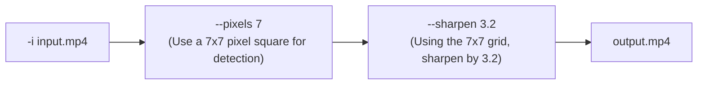
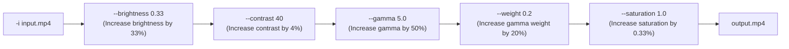
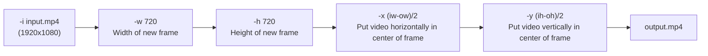
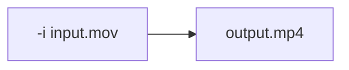

<div id="top"></div>

<div align="center">


<h3 align="center">FFMPEG Util scripts and Templates</h3>
</div>

FFMPEG wrapper scripts and a script runner that reads JSON configuration files. 
The wrapper scripts provide an interface for executing specific tasks, while the script runner allows users to define a series of tasks to be performed on a set of media files. 
This automation pipeline saves time and effort, enabling users to execute multiple tasks on numerous media files with a single command.


# Highlights

- 🏃‍♂️ Automate FFMPEG steps using a JSON file
- 💡 Simple independent scripts for specific ffmpeg tasks.
- 🏗️ Build videos in a pipeline automatically
- 📲 Download from external sources
- 📦 Run bulk tasks on folders of video files
- 🎨 Built-in variables for randomness, folders, colour and tailwindcss palettes

# Scripts

| Script               | Description                                                      |
| -------------------- | ---------------------------------------------------------------- |
| `ff_append.sh`       | This will concatenate two videos together and re-encode them     |
| `ff_aspect_ratio.sh` | Changes the container metadata's Display Aspect Ratio (DAR)      |
| `ff_audio.sh`        | Overlay audio onto video track                                   |
| `ff_blur.sh`         | Simple blur function using an unsharp mask                       |
| `ff_colour.sh`       | Change brightness, contrast, gamma, saturation of video          |
| `ff_concat.sh`       | Concatenate multiple videos together                             |
| `ff_convert.sh`      | Convert an apple quicktime MOV to MP4 file                        |
| `ff_crop.sh`         | Crop video to specific size                                       |
| `ff_cut.sh`          | Cut video from start time to end time.                           |
| `ff_download.sh`     | Use CURL to download multiple files. Useful for scriptflow.        |
| `ff_flip.sh`          | Horizontally and/or vertically flip the video                     |
| `ff_fps.sh`          | Alter the FPS without changing length of video                   |
| `ff_grouptime.sh`    | Proportionally trims and concats videos to target video duration |
| `ff_image.sh`        | Make a video from a looped image                                 |
| `ff_kenburns.sh`     | Generate a video from an image with a zoom-pan effect            |
| `ff_lut.sh`          | Apply a 3DL/Cube LUT file to a video                              |
| `ff_middle.sh`       | Remove equal number of seconds from start and end of video       |
| `ff_overlay.sh`      | Overlay an image or video on top of another video                |
| `ff_pad.sh`          | Add a background padding around the video                        |
| `ff_proxy.sh`        | Create a down-scaled,res,fps,crf proxy file for a video           |
| `ff_rotate.sh`       | Rotate a video in 90 degree increments                           |
| `ff_scale.sh`        | Change the width and height of the video                         |
| `ff_sh_runner.sh`    | Run any shell command (dangerous!)                               |
| `ff_sharpen.sh`      | Simple sharpen function using an unsharp mask                    |
| `ff_social_media.sh` | Converts the video, ready for various social platforms           |
| `ff_stack.sh`        | Align two videos vertically, horizontally or in a 2x2 grid.      |
| `ff_subtitles.sh`    | Use SRT File to overlay hard-embedded subtitles                  |
| `ff_text.sh`         | Add text (with background box) on top of the video               |
| `ff_thumbnail.sh`    | Create thumbnail(s) from the video                               |
| `ff_to_landscape.sh` | Rotate a portrait video to landscape                             |
| `ff_to_portrait.sh`  | Rotate a landscape video to portrait                             |
| `ff_transcode.sh`    | Bulk Convert videos to specific file format and specs              |
| `ff_transition.sh`   | Concatenate multiple videos with transition effects              |
| `ff_unsharp.sh`      | Use an unsharp mask to blur/sharpen luma,gamma,alpha             |
| `ff_watermark.sh`    | Overlay a watermark image/video                                  |


# Table of Contents
<!-- TOC -->

- [Highlights](#highlights)
- [Scripts](#scripts)
- [Table of Contents](#table-of-contents)
    - [About The Project](#about-the-project)
        - [Built With](#built-with)
        - [Installation](#installation)
    - [Configs](#configs)
    - [Script Details](#script-details)
        - [ff_append.sh](#ff_appendsh)
            - [Description](#description)
            - [Flags](#flags)
            - [Example](#example)
        - [ff_aspect_ratio.sh](#ff_aspect_ratiosh)
            - [Description](#description)
            - [Flags](#flags)
        - [ff_audio.sh](#ff_audiosh)
            - [Description](#description)
            - [Flags](#flags)
        - [ff_blur.sh](#ff_blursh)
            - [Description](#description)
            - [Flags](#flags)
        - [ff_colour.sh](#ff_coloursh)
            - [Description](#description)
            - [Flags](#flags)
        - [ff_concat.sh](#ff_concatsh)
            - [Description](#description)
            - [Flags](#flags)
        - [ff_crop.sh](#ff_cropsh)
            - [Description](#description)
            - [Flags](#flags)
        - [ff_cut.sh](#ff_cutsh)
            - [Description](#description)
            - [Flags](#flags)
        - [ff_download.sh](#ff_downloadsh)
            - [Flags](#flags)
            - [Examples](#examples)
                - [Single Download](#single-download)
                - [Multiple Downloads](#multiple-downloads)
                - [Using a URL Source.](#using-a-url-source)
                - [URL Source randomised strategy.](#url-source-randomised-strategy)
        - [ff_flip.sh](#ff_flipsh)
            - [Description](#description)
            - [Flags](#flags)
        - [ff_fps.sh](#ff_fpssh)
            - [Description](#description)
            - [Flags](#flags)
        - [ff_grouptime.sh](#ff_grouptimesh)
            - [Description](#description)
            - [Flags](#flags)
        - [ff_image.sh](#ff_imagesh)
            - [Description](#description)
            - [Flags](#flags)
        - [ff_kenburns.sh](#ff_kenburnssh)
            - [Description](#description)
            - [Flags](#flags)
        - [ff_lut.sh](#ff_lutsh)
            - [Description](#description)
            - [Flags](#flags)
        - [ff_middle.sh](#ff_middlesh)
            - [Description](#description)
            - [Flags](#flags)
        - [ff_mov_to_mp4.sh](#ff_mov_to_mp4sh)
            - [Description](#description)
            - [Flags](#flags)
        - [ff_pad.sh](#ff_padsh)
            - [Description](#description)
            - [Flags](#flags)
            - [Examples](#examples)
        - [ff_proxy.sh](#ff_proxysh)
            - [Flags](#flags)
        - [ff_rotate.sh](#ff_rotatesh)
            - [Description](#description)
            - [Flags](#flags)
        - [ff_scale.sh](#ff_scalesh)
            - [Description](#description)
            - [Flags](#flags)
        - [ff_sh_runner.sh](#ff_sh_runnersh)
            - [Description](#description)
            - [Flags](#flags)
        - [ff_sharpen.sh](#ff_sharpensh)
            - [Description](#description)
            - [Flags](#flags)
        - [ff_social_media.sh](#ff_social_mediash)
            - [Description](#description)
            - [Flags](#flags)
        - [ff_stack.sh](#ff_stacksh)
            - [Description](#description)
            - [Flags](#flags)
        - [ff_subtitles.sh](#ff_subtitlessh)
            - [Description](#description)
        - [Forced Styles:](#forced-styles)
            - [Flags](#flags)
        - [ff_text.sh](#ff_textsh)
            - [Description](#description)
            - [Flags](#flags)
        - [ff_thumbnail.sh](#ff_thumbnailsh)
            - [Description](#description)
            - [Flags](#flags)
        - [ff_to_landscape.sh](#ff_to_landscapesh)
            - [Description](#description)
            - [Flags](#flags)
        - [ff_to_portrait.sh](#ff_to_portraitsh)
            - [Description](#description)
            - [Flags](#flags)
        - [ff_transcode.sh](#ff_transcodesh)
            - [Description](#description)
            - [Flags](#flags)
        - [ff_transition.sh](#ff_transitionsh)
            - [Description](#description)
            - [Flags](#flags)
        - [ff_unsharp.sh](#ff_unsharpsh)
            - [Description](#description)
            - [Flags](#flags)
        - [ff_watermark.sh](#ff_watermarksh)
            - [Description](#description)
            - [Flags](#flags)
            - [Examples](#examples)
    - [ScriptFlow](#scriptflow)
        - [Blank flags](#blank-flags)
        - [nulls](#nulls)
        - [Multiple duplicate scripts](#multiple-duplicate-scripts)
        - [Scripts with multiple inputs](#scripts-with-multiple-inputs)
        - [Keyword Replacements](#keyword-replacements)
            - [<ENV\_\*>](#env%5C_%5C)
            - [<FOLDER_NAME>](#folder_name)
            - [<FOLDER_TITLE>](#folder_title)
            - [<DATE_format>](#date_format)
            - [<RANDOM_VIDEO>](#random_video)
            - [<RANDOM_VIDEO_FILTER_string>](#random_video_filter_string)
            - [<RANDOM_COLOUR>](#random_colour)
            - [<RANDOM_CONTRAST_COLOUR>](#random_contrast_colour)
            - [<CONSTANT_RANDOM_COLOUR>](#constant_random_colour)
            - [<CONSTANT_CONTRAST_COLOUR>](#constant_contrast_colour)
        - [Output & Cleanup](#output--cleanup)
        - [pwd and file references](#pwd-and-file-references)
        - [descriptions](#descriptions)
    - [Customising](#customising)
    - [Troubleshooting](#troubleshooting)
        - [Output Files.](#output-files)
    - [Contributing](#contributing)
    - [License](#license)
    - [Contact](#contact)
    - [Changelog](#changelog)
        - [Version 1.10](#version-110)
        - [Version 1.9](#version-19)
        - [Version 1.8](#version-18)
        - [Version 1.7](#version-17)
        - [Version 1.6](#version-16)
        - [Version 1.5](#version-15)
        - [Version 1.4](#version-14)
        - [Version 1.3](#version-13)
        - [Version 1.2](#version-12)
        - [Version 1.1](#version-11)
        - [Version 1.0](#version-10)

<!-- /TOC -->

## 2. About The Project

This is a collection of scripts to automate simple video editing tasks.

They can be easily chained together for more complex video effects and tasks by simply using a JSON configuration file.

These are all based on BASH and FFMPEG.

<p align="right">(<a href="#top">back to top</a>)</p>

### 2.1. Built With

This project was built with the following frameworks, technologies and software.

-   [JQ](https://stedolan.github.io/jq/)

<p align="right">(<a href="#top">back to top</a>)</p>

### 2.2. Installation

These are the steps to get up and running with this theme.

1. Clone the repo

```sh
git clone https://github.com/IORoot/ffmpeg__bash-scripts
```

2. Either update your $PATH to include this folder or create a link in `/usr/local/bin` to each script.

```
PATH=$PATH:$(pwd)
```

<p align="right">(<a href="#top">back to top</a>)</p>

Additionally:

| Script          | Description                                                          |
| --------------- | -------------------------------------------------------------------- |
| `scriptflow.sh` | Reads a JSON configuration file a runs the ff\_ scripts sequentially |

## Configs

You can provide any of the scripts a configuration JSON file with the `-C|--config` flag.
This JSON file should contain an object with the keys as the flags to the script and the values as the values you would pass on the command line.

For instance, the following command:

```bash
./ff_scale.sh -i input_video.mp4 -o output_video.mp4 -w 1920 -h 1080 -l debug
```

Can have a config.json file that would do the same thing:

```json
{
	"input": "input_video.mp4",
	"output": "output_video.mp4",
	"width": "1920",
	"height": "1080<!-- TOC -->

- [Table of Contents](#table-of-contents)
- [About The Project](#about-the-project)
    - [Built With](#built-with)
    - [Installation](#installation)
- [Usage](#usage)
- [Configs](#configs)
- [Script Details](#script-details)
    - [ff_append.sh](#ff_appendsh)
        - [Description](#description)
        - [Flags](#flags)
        - [Example](#example)
    - [ff_aspect_ratio.sh](#ff_aspect_ratiosh)
        - [Description](#description)
        - [Flags](#flags)
    - [ff_audio.sh](#ff_audiosh)
        - [Description](#description)
        - [Flags](#flags)
    - [ff_blur.sh](#ff_blursh)
        - [Description](#description)
        - [Flags](#flags)
    - [ff_colour.sh](#ff_coloursh)
        - [Description](#description)
        - [Flags](#flags)
    - [ff_concat.sh](#ff_concatsh)
        - [Description](#description)
        - [Flags](#flags)
    - [ff_crop.sh](#ff_cropsh)
        - [Description](#description)
        - [Flags](#flags)
    - [ff_cut.sh](#ff_cutsh)
        - [Description](#description)
        - [Flags](#flags)
    - [ff_download.sh](#ff_downloadsh)
        - [Flags](#flags)
        - [Examples](#examples)
            - [Single Download](#single-download)
            - [Multiple Downloads](#multiple-downloads)
            - [Using a URL Source.](#using-a-url-source)
            - [URL Source randomised strategy.](#url-source-randomised-strategy)
    - [ff_flip.sh](#ff_flipsh)
        - [Description](#description)
        - [Flags](#flags)
    - [ff_fps.sh](#ff_fpssh)
        - [Description](#description)
        - [Flags](#flags)
    - [ff_grouptime.sh](#ff_grouptimesh)
        - [Description](#description)
        - [Flags](#flags)
    - [ff_image.sh](#ff_imagesh)
        - [Description](#description)
        - [Flags](#flags)
    - [ff_kenburns.sh](#ff_kenburnssh)
        - [Description](#description)
        - [Flags](#flags)
    - [ff_lut.sh](#ff_lutsh)
        - [Description](#description)
        - [Flags](#flags)
    - [ff_middle.sh](#ff_middlesh)
        - [Description](#description)
        - [Flags](#flags)
    - [ff_mov_to_mp4.sh](#ff_mov_to_mp4sh)
        - [Description](#description)
        - [Flags](#flags)
    - [ff_pad.sh](#ff_padsh)
        - [Description](#description)
        - [Flags](#flags)
        - [Examples](#examples)
    - [ff_proxy.sh](#ff_proxysh)
        - [Flags](#flags)
    - [ff_rotate.sh](#ff_rotatesh)
        - [Description](#description)
        - [Flags](#flags)
    - [ff_scale.sh](#ff_scalesh)
        - [Description](#description)
        - [Flags](#flags)
    - [ff_sh_runner.sh](#ff_sh_runnersh)
        - [Description](#description)
        - [Flags](#flags)
    - [ff_sharpen.sh](#ff_sharpensh)
        - [Description](#description)
        - [Flags](#flags)
    - [ff_social_media.sh](#ff_social_mediash)
        - [Description](#description)
        - [Flags](#flags)
    - [ff_stack.sh](#ff_stacksh)
        - [Description](#description)
        - [Flags](#flags)
    - [ff_subtitles.sh](#ff_subtitlessh)
        - [Description](#description)
    - [Forced Styles:](#forced-styles)
        - [Flags](#flags)
    - [ff_text.sh](#ff_textsh)
        - [Description](#description)
        - [Flags](#flags)
    - [ff_thumbnail.sh](#ff_thumbnailsh)
        - [Description](#description)
        - [Flags](#flags)
    - [ff_to_landscape.sh](#ff_to_landscapesh)
        - [Description](#description)
        - [Flags](#flags)
    - [ff_to_portrait.sh](#ff_to_portraitsh)
        - [Description](#description)
        - [Flags](#flags)
    - [ff_transcode.sh](#ff_transcodesh)
        - [Description](#description)
        - [Flags](#flags)
    - [ff_transition.sh](#ff_transitionsh)
        - [Description](#description)
        - [Flags](#flags)
    - [ff_unsharp.sh](#ff_unsharpsh)
        - [Description](#description)
        - [Flags](#flags)
    - [ff_watermark.sh](#ff_watermarksh)
        - [Description](#description)
        - [Flags](#flags)
        - [Examples](#examples)
- [ScriptFlow](#scriptflow)
    - [Blank flags](#blank-flags)
    - [nulls](#nulls)
    - [Multiple duplicate scripts](#multiple-duplicate-scripts)
    - [Scripts with multiple inputs](#scripts-with-multiple-inputs)
    - [Keyword Replacements](#keyword-replacements)
        - [<ENV\_\*>](#env%5C_%5C)
        - [<FOLDER_NAME>](#folder_name)
        - [<FOLDER_TITLE>](#folder_title)
        - [<DATE_format>](#date_format)
        - [<RANDOM_VIDEO>](#random_video)
        - [<RANDOM_VIDEO_FILTER_string>](#random_video_filter_string)
        - [<RANDOM_COLOUR>](#random_colour)
        - [<RANDOM_CONTRAST_COLOUR>](#random_contrast_colour)
        - [<CONSTANT_RANDOM_COLOUR>](#constant_random_colour)
        - [<CONSTANT_CONTRAST_COLOUR>](#constant_contrast_colour)
    - [Output & Cleanup](#output--cleanup)
    - [pwd and file references](#pwd-and-file-references)
    - [descriptions](#descriptions)
- [Customising](#customising)
- [Troubleshooting](#troubleshooting)
    - [Output Files.](#output-files)
- [Contributing](#contributing)
- [License](#license)
- [Contact](#contact)
- [Changelog](#changelog)
    - [Version 1.9](#version-19)
    - [Version 1.8](#version-18)
    - [Version 1.7](#version-17)
    - [Version 1.6](#version-16)
    - [Version 1.5](#version-15)
    - [Version 1.4](#version-14)
    - [Version 1.3](#version-13)
    - [Version 1.2](#version-12)
    - [Version 1.1](#version-11)
    - [Version 1.0](#version-10)

<!-- /TOC -->",
	"loglevel": "debug"
}
```

And run like this:

```bash
./ff_scale.sh -c config.json
```

For scripts that require multiple inputs, you can use `input1`, `input2`, etc... Suffix 1 or 2 digits.

## Script Details

### `ff_append.sh`

#### Description

This will append two files together while re-encoding them to be the same codec. Good if you need to change the codec of the video by transcoding them. Note the `ff_concat.sh` script is better if you do not need to transcode.


#### Flags

```bash
Flags:
-f | --first <FIRST_INPUT_FILE>
    The name of the first input file.

-s | --second <SECOND_INPUT_FILE>
    The name of the second input file.

-o | --output <OUTPUT_FILE>
    Default is output_appended.mp4
    The name of the output file.

-l | --loglevel <LOGLEVEL>
    The FFMPEG loglevel to use. Default is 'error' only.
    Options: quiet,panic,fatal,error,warning,info,verbose,debug,trace
```

#### Example

```bash
./ff_append.sh -f landscape2.mp4 -s landscape.mp4 -o out.mp4
```

---

### `ff_aspect_ratio.sh`

#### Description

This will alter the container metadata (DAR) of the video to the new aspect ratio.


#### Flags

```
-i | --input <INPUT_FILE>
    The name of an input file.

-o | --output <OUTPUT_FILE>
    Default is output_aspect_ratio.mp4
    The name of the output file.

-a | --aspect <ASPECTRATIO>
    Target aspect ratio should be expressed as X:Y
    Default is 1:1

-c | --config <CONFIG_FILE>
    The name of an input config file.

-l | --loglevel <LOGLEVEL>
    The FFMPEG loglevel to use. Default is 'error' only.
    Options: quiet,panic,fatal,error,warning,info,verbose,debug,trace
```

---


### `ff_audio.sh`

#### Description

This will overlay audio on top of the video.

#### Flags

```
-i | --input <INPUT_FILE>
    The name of an input file.

-a | --audio <INPUT_FILE>
    The name of an audio file.

-o | --output <OUTPUT_FILE>
    Default is %s "${OUTPUT_FILENAME}"
    The name of the output file.

-s | --start <SECONDS>
    Start time in seconds of when to play audio.

-p | --speed <SPEED>
    Playback speed of the audio.

-r | --remove
    tRemove the audio.
    
-c | --config <CONFIG_FILE>
    The name of an input config file.

-l | --loglevel <LOGLEVEL>
    The FFMPEG loglevel to use. Default is 'error' only.
    Options: quiet,panic,fatal,error,warning,info,verbose,debug,trace
```

---

### `ff_blur.sh`

#### Description

Simple version of unsharp mask.



#### Flags

```
-i | --input <INPUT_FILE>
    The name of an input file.

-o | --output <OUTPUT_FILE>
    Default is output_sharpen.mp4
    The name of the output file.

-p | --pixels <AMOUNT>
    Both the X and Y matrix horizontal size. It must be an odd integer between 3 and 23. The default value is 5.

-s | --sharpen <AMOUNT>
    Set the sharpen strength. It must be a floating point number. -2.0 to 5.0. Default value is 1.0.
    Negative values will blur the input video, while positive values will sharpen it, a value of zero will disable the effect.

-c | --config <CONFIG_FILE>
    The name of an input config file.

-l | --loglevel <LOGLEVEL>
    The FFMPEG loglevel to use. Default is 'error' only.
    Options: quiet,panic,fatal,error,warning,info,verbose,debug,trace
```

---

### `ff_colour.sh`

#### Description

Change the Brightness, Contrast, Gamma, Gamma-Weight and Saturation of a video.



#### Flags

```
-i | --input <INPUT_FILE>
    The name of an input file.

-o | --output <OUTPUT_FILE>
    Default is output_colour.mp4
    The name of the output file.

-b | --brightness <BRIGHTNESS>
    Change the brightness value from -1.0 to 1.0.

-c | --contrast <CONTRAST>
    Change the contrast value from -1000.0 to 1000.0.

-g | --gamma <GAMMA>
    Change the gamma value from 0.1 to 10.0.

-s | --saturation <SATURATION>
    Change the saturation value from 0.0 to 3.0.

-w | --weight <GAMMAWEIGHT>
    Change the gamma weight value from 0.0 to 1.0.

-c | --config <CONFIG_FILE>
    The name of an input config file.

-l | --loglevel <LOGLEVEL>
    The FFMPEG loglevel to use. Default is 'error' only.
    Options: quiet,panic,fatal,error,warning,info,verbose,debug,trace
```

---

### `ff_concat.sh`

#### Description

Concatenate multiple videos into one output video.

The first video will set the FPS and dimensions, so make sure all videos are the same otherwise you'll get slow-motion.


#### Flags

```
-o | --output <OUTPUT_FILE>
    The name of the output file. Specify only one.

-i | --input <INPUT_FILE>
    The name of an input file (or folder). Specify as many as you wish.

-c | --config <CONFIG_FILE>
    The name of an input config file.

-l | --loglevel <LOGLEVEL>
    The FFMPEG loglevel to use. Default is 'error' only.
    Options: quiet,panic,fatal,error,warning,info,verbose,debug,trace
```

---

### `ff_crop.sh`

#### Description

Crop video to specific size




#### Flags

```
-i | --input <INPUT_FILE>
    The name of an input file.

-o | --output <OUTPUT_FILE>
    Default is output_crop.mp4
    The name of the output file.

-w | --width <WIDTH>
    Width of the output video. Default: 600px.

-h | --height <HEIGHT>
    Height of the output video. Default: 600px.

-x | --xpixels <PIXELS>
    Where to position the video in the frame on X-Axis from left. Default center: (iw-ow)/2

-y | --ypixels <PIXELS>
    Where to position the video in the frame on Y-Axis from top. Default center: (ih-oh)/2

    The width, height, x and y parameters also have access to the following variables:
    - iw : The input video's width.
    - ih : The input video's height.
    - ow : The output video's width.
    - oh : The output video's height.
    These can be used to calculate areas of the screen. For example:
    The center of the screen on x-axis is 'x=(ow-iw)/2

-c | --config <CONFIG_FILE>
    The name of an input config file.

-l | --loglevel <LOGLEVEL>
    The FFMPEG loglevel to use. Default is 'error' only.
    Options: quiet,panic,fatal,error,warning,info,verbose,debug,trace
```

---

### `ff_cut.sh`

#### Description

Change the length of the video.


#### Flags

```
-i | --input <INPUT_FILE>
    The name of an input file.

-o | --output <OUTPUT_FILE>
    Default is output_cut.mp4
    The name of the output file.

-s | --start <TIMESTAMP>
    When to start the cut. Format is HH:MM:SS. Default is the beginning of the video. 00:00:00.

-e | --end <TIMESTAMP>
    When to finish the cut. Format is HH:MM:SS. Default is 10 seconds into the video. 00:00:10.

-c | --config <CONFIG_FILE>
    The name of an input config file.

-l | --loglevel <LOGLEVEL>
    The FFMPEG loglevel to use. Default is 'error' only.
    Options: quiet,panic,fatal,error,warning,info,verbose,debug,trace
```

---

### `ff_download.sh`

Download a video or file to use in the scriptflow. Uses CURL.

Very handy to get a remote file(s) images/videos to then use in your video.

#### Flags

```
-i | --input <INPUT_URL>
    The input url to download.

-o | --output <OUTPUT_FILE>
    Default is %s "${OUTPUT_FILENAME}"
    The name of the output file.

-u | --urlsource <FILE_WITH_LIST>
    A URL of a txt file with a list of all files to use as inputs. Separated one per line.

-s | --strategy <STRATEGY>
    5 A number. First 5 videos from inputs. Prefix number on output filename. Default 1.
    ~5 Tilde(~) followed by a number. Random 5 videos from inputs. Prefix number on output filename.

-C | --config <CONFIG_FILE>
    Supply a config.json file with settings instead of command-line. Requires JQ installed.

-l | --loglevel <LOGLEVEL>
    The FFMPEG loglevel to use. Default is 'error' only.
    Options: quiet,panic,fatal,error,warning,info,verbose,debug,trace

```

#### Examples

The download script is quite a powerful tool to auto-generate your videos. It can incorporate randomness if needed.

Here are some examples using the `scriptflow` tool and the JSON input format:

---

##### Single Download

This example will just download a single file from a URL.

```json
{
	"ff_download": {
		"description": "Download the my watermark image",
		"input": "http://mywebsite.com/logos/logo_white_solid.jpg",
		"output": "logo_white_solid.jpg"
	}
}
```

---

##### Multiple Downloads

This time we will download two images that will be output as `1_logo_solid.jpg` and `2_logo_solid.jpg`.

```json
{
	"ff_download": {
		"description": "Download the my watermark image",
		"input1": "http://mywebsite.com/logos/logo_white_solid.jpg",
		"input2": "http://mywebsite.com/logos/logo_blue_solid.jpg",
		"output": "logo_solid.jpg",
		"strategy": "2"
	}
}
```

---

##### Using a URL Source.

You can provide a URL of a text file listing all of the available files and download some from that list.
For example, you provide the following file:

`filelist.txt`

```text
my_video_01.mp4
my_video_02.mp4
my_video_03.mp4
my_video_04.mp4
my_video_05.mp4
```

And host that file (and those video files) at: `http://mywebsite.com/filelist.txt`

Now, you can use that text file as a reference and use the `strategy` field to download the first 2.

```json
{
	"ff_download": {
		"description": "Download the my watermark image",
		"urlsource": "http://mywebsite.com/filelist.txt",
		"output": "ff_download.mp4",
		"strategy": "2"
	}
}
```

This will download files `my_video_01.mp4` and `my_video_02.mp4`. These will be output as `1_ff_download.mp4` and `2_ff_download.mp4`.

---

##### URL Source randomised strategy.

The true power is found with the randomised strategy. Using the tilde `~` symbol as a prefix on the strategy you can specify how many _random_ files to download.

```json
{
	"ff_download": {
		"description": "Download the my watermark image",
		"urlsource": "http://mywebsite.com/filelist.txt",
		"output": "ff_download.mp4",
		"strategy": "~2"
	}
}
```

This will download two random files `my_video_03.mp4` and `my_video_05.mp4`. These will be output as `1_ff_download.mp4` and `2_ff_download.mp4`.

---

### `ff_flip.sh`

#### Description

Flip video horizontally and/or vertically.


#### Flags

```
-i | --input <INPUT_FILE>
    The name of an input file.

-o | --output <OUTPUT_FILE>
    Default is output_flipped.mp4
    The name of the output file.

-h | --horizontal
    Flip video horizontally.

-v | --vertical
    Flip video vertically.

-c | --config <CONFIG_FILE>
    The name of an input config file.

-l | --loglevel <LOGLEVEL>
    The FFMPEG loglevel to use. Default is 'error' only.
    Options: quiet,panic,fatal,error,warning,info,verbose,debug,trace
```

---

### `ff_fps.sh`

#### Description

Change the FPS of a video without changing the length.


#### Flags

```
-i | --input <INPUT_FILE>
    The name of an input file.

-o | --output <OUTPUT_FILE>
    Default is output_fps.mp4
    The name of the output file.

-f | --fps <FPS>
    The frames per second the video should be converted to. The default value is 30.
    The length of the video will not change, but frames will either be added or removed.

-c | --config <CONFIG_FILE>
    The name of an input config file.

-l | --loglevel <LOGLEVEL>
    The FFMPEG loglevel to use. Default is 'error' only.
    Options: quiet,panic,fatal,error,warning,info,verbose,debug,trace
```

---

### `ff_grouptime.sh`

#### Description

Trim input videos by a percentage on start and end to get output video to correct duration.


#### Flags

```
-i | --input <INPUT_FILE>
    The name of an input file.

-o | --output <OUTPUT_FILE>
    Default is ff_grouptime.mp4
    The name of the output file.

-d | --duration <DURATION>
    The final duration of the output file in seconds. Default is 60.

-c | --config <CONFIG_FILE>
    The name of an input config file.

-l | --loglevel <LOGLEVEL>
    The FFMPEG loglevel to use. Default is 'error' only.
    Options: quiet,panic,fatal,error,warning,info,verbose,debug,trace
```

---

### `ff_image.sh`

#### Description

Create a video from an image

#### Flags

```
-i | --input <INPUT_FILE>
    The name of an input file.

-o | --output <OUTPUT_FILE>
    Default is ff_image.mp4
    The name of the output file.

-d | --duration <DURATION>
    The final duration of the output file in seconds. Default is 60.

-c | --config <CONFIG_FILE>
    The name of an input config file.

-l | --loglevel <LOGLEVEL>
    The FFMPEG loglevel to use. Default is 'error' only.
    Options: quiet,panic,fatal,error,warning,info,verbose,debug,trace
```

---


### `ff_kenburns.sh`

#### Description

Create a video from an image with a zoom-pan effect.

#### Flags

```
 -i | --input <INPUT_FILE>
    The name of the input file.

 -t | --target <TARGET>
    The target of the zoom.
    TopLeft    | TopRight.
    BottomLeft | BottomRight.
    Random

 -f | --fps <FPS>
    Default is 30
    The Output Frames Per Second.

 -w | --width <PIXELS>
    Default is 1024
    The output width.

 -h | --height <PIXELS>
    Default is 720
    The output height.

 -d | --duration <SECS>
    Default is 10
    The output duration in seconds.

 -s | --speed <FLOAT>
    Default is 0.003
    The speed of the zoom.

 -b | --bitrate <BITRATE>
    Default is 5000k
    The bitrate of the output file.

 -o | --output <OUTPUT_FILE>
    Default is ff_kenburns.mp4
    The name of the output file.

-c | --config <CONFIG_FILE>
    The name of an input config file.

-l | --loglevel <LOGLEVEL>
    The FFMPEG loglevel to use. Default is 'error' only.
    Options: quiet,panic,fatal,error,warning,info,verbose,debug,trace

```

---


### `ff_lut.sh`

#### Description

Apply a 3DL/Cube Look-Up Table (LUT) file to a video.

#### Flags

```
-i | --input <INPUT_FILE>
    The name of an input file.

-o | --output <OUTPUT_FILE>
    Default is output_lut.mp4
    The name of the output file.

-t | --lut <LUT_FILE>
    The Look-Up-Table (LUT) should be in a 3DL/Cube format.
    there is no default, so must be supplied.

-c | --config <CONFIG_FILE>
    The name of an input config file.

-l | --loglevel <LOGLEVEL>
    The FFMPEG loglevel to use. Default is 'error' only.
    Options: quiet,panic,fatal,error,warning,info,verbose,debug,trace
```

---

### `ff_middle.sh`

#### Description

Trim input video from start and end by a number of seconds.


#### Flags

```
-i | --input <INPUT_FILE>
    The name of an input file.

-o | --output <OUTPUT_FILE>
    Default is output_middle.mp4
    The name of the output file.

-t | --trim <TRIM>
    Number of seconds to remove from the start and end of video. Default is 1 second. (1)

-c | --config <CONFIG_FILE>
    The name of an input config file.

-l | --loglevel <LOGLEVEL>
    The FFMPEG loglevel to use. Default is 'error' only.
    Options: quiet,panic,fatal,error,warning,info,verbose,debug,trace
```

---

### `ff_mov_to_mp4.sh`

#### Description

Convert an Apple Quicktime MOV file into an H264 MP4 file. Useful when grouping/appending/concating multiple files.



#### Flags

```
-i | --input <INPUT_FILE>
    The name of an input file.

-o | --output <OUTPUT_FILE>
    Default is output_mov.mp4
    The name of the output file.

-c | --config <CONFIG_FILE>
    The name of an input config file.

-l | --loglevel <LOGLEVEL>
    The FFMPEG loglevel to use. Default is 'error' only.
    Options: quiet,panic,fatal,error,warning,info,verbose,debug,trace
```

---

### `ff_pad.sh`

#### Description

Create padding around the edges of the video.


#### Flags

```
-i | --input <INPUT_FILE>
    The name of an input file.

-o | --output <OUTPUT_FILE>
    Default is output_pad.mp4
    The name of the output file.

-w | --width <WIDTH>
    Width of the output video. Default: Same as input video.

-h | --height <HEIGHT>
    Height of the output video. Default: 2x input video height.

-x | --xpixels <PIXELS>
    Where to position the video in the frame on X-Axis from left.

-y | --ypixels <PIXELS>
    Where to position the video in the frame on Y-Axis from top.

    The width, height, x and y parameters also have access to the following variables:
    - iw : The input video's width.
    - ih : The input video's height.
    - ow : The output video's width.
    - oh : The output video's height.
    These can be used to calculate areas of the screen. For example:
    The center of the screen on x-axis is 'x=(ow-iw)/2

-c | --colour <COLOUR>
    Colour to use for the padding. See https://ffmpeg.org/ffmpeg-utils.html#color-syntax
    Can use a word 'Aqua, Beige, Cyan, etc...', the word 'random' or hex code : RRGGBB[AA]

-C | --config <CONFIG_FILE>
    The name of an input config file.

-l | --loglevel <LOGLEVEL>
    The FFMPEG loglevel to use. Default is 'error' only.
    Options: quiet,panic,fatal,error,warning,info,verbose,debug,trace
```

#### Examples

Padding all around the video.

    ./ff_pad.sh -i input.mp4 -h 'ih*2' -w 'iw*2'

Video Pad white background.

    ./ff_pad.sh -i input.mp4 -h 'ih*2' -c white

Make black bars..

    /ff_pad.sh -i input.mp4 -w iw -h ih+100 -y '(oh-ih)/2' -x '(ow-iw)/2' -c #000000

---

### `ff_proxy.sh`

Downgrade large videos to a more manageable file size

#### Flags

```
-i | --input <INPUT_FILE / INPUT_FOLDER>
    The name of an input file.
    If a FOLDER, then it is recursive.

-o | --output <OUTPUT_FILE>
    Default is %s "${OUTPUT_FILENAME}"
    The name of the output file.

-r | --recursive
    If a FOLDER, then recurse to deeper folders.

-x | --scalex
    Width of the output proxy. can use -2 to keep aspect ratio to scaley. Default 1280.

-y | --scaley
    Height of the output proxy. can use -2 to keep aspect ratio to scalex. Default -2.

-f | --fps
    Frames Per Second to reduce the proxy down to. Default 30.

-c | --CRF
    Constant Rate Factor. 0-51. Controls the quality of the output. Default 25.

-d | --codec
    Codec library to use. libxwebp / libx264 / libx265 /etc... Default libx264.

-g | --grep <STRING>
    Supply a grep string for filtering the inputs if a folder is specified.

-C | --config <CONFIG_FILE>
    Supply a config.json file with settings instead of command-line. Requires JQ installed.

-l | --loglevel <LOGLEVEL>
    The FFMPEG loglevel to use. Default is 'error' only.
    Options: quiet,panic,fatal,error,warning,info,verbose,debug,trace
```

---

### `ff_rotate.sh`

#### Description

Rotate a video.


#### Flags

```
Usage: ./ff_rotate.sh FILE [ROTATION] [OUTPUT_FILE]

[rotation]
0 = 180 Degrees
1 = 90 Degrees Clockwise
2 = 90 Degrees Counter Clockwise (default)

[output file]
output_rotate.mp4 (default)
```

---

### `ff_scale.sh`

#### Description

Change the scale (Width/Height) of a video.


#### Flags

```
-i | --input <INPUT_FILE>
    The name of an input file.

-o | --output <OUTPUT_FILE>
    Default is output_scale.mp4
    The name of the output file.

-w | --width <PIXELS>
    The width of the video. The default value is 1920.

-h | --height <PIXELS>
    The height of the video. The default value is 1920.

-c | --config <CONFIG_FILE>
    The name of an input config file.

-l | --loglevel <LOGLEVEL>
    The FFMPEG loglevel to use. Default is 'error' only.
    Options: quiet,panic,fatal,error,warning,info,verbose,debug,trace
```

---


### `ff_sh_runner.sh`

#### Description

WARNING! This is dangerous to have on a machine! Gives access to the shell to run
any command. If in doubt, remove this script.

This is only available through the scriptflow runner to enable running commands
through a JSON object.

#### Flags

```
-c | --config <CONFIG_FILE>
    The name of an input config file.
```


---

### `ff_sharpen.sh`

#### Description

Simple version of unsharp mask.

#### Flags

```
-i | --input <INPUT_FILE>
    The name of an input file.

-o | --output <OUTPUT_FILE>
    Default is output_sharpen.mp4
    The name of the output file.

-p | --pixels <AMOUNT>
    Both the X and Y matrix horizontal size. It must be an odd integer between 3 and 23. The default value is 5.

-s | --sharpen <AMOUNT>
    Set the sharpen strength. It must be a floating point number. -2.0 to 5.0. Default value is 1.0.
    Negative values will blur the input video, while positive values will sharpen it, a value of zero will disable the effect.

-c | --config <CONFIG_FILE>
    The name of an input config file.

-l | --loglevel <LOGLEVEL>
    The FFMPEG loglevel to use. Default is 'error' only.
    Options: quiet,panic,fatal,error,warning,info,verbose,debug,trace
```

---


### `ff_social_media.sh`

#### Description

Converts the video, ready for various social platforms

#### Flags

```
-i | --input <INPUT_FILE>
    The name of an input file.

-o | --output <OUTPUT_FILE>
    Default is output_sharpen.mp4
    The name of the output file.

-ig | --instagram 
    Convert ready for Instagram.

-c | --config <CONFIG_FILE>
    The name of an input config file.

-l | --loglevel <LOGLEVEL>
    The FFMPEG loglevel to use. Default is 'error' only.
    Options: quiet,panic,fatal,error,warning,info,verbose,debug,trace
```

---

### `ff_stack.sh`

#### Description

Stack multiple videos. Either two vertically, two horizontally or four in a 2x2 grid.


#### Flags

```
-i | --input <INPUT_FILE>
    The name of an input file.

-o | --output <OUTPUT_FILE>
    Default is output_sharpen.mp4
    The name of the output file.

-h | --horizontal

-v | --vertical

-g | --grid

-c | --config <CONFIG_FILE>
    The name of an input config file.

-l | --loglevel <LOGLEVEL>
    The FFMPEG loglevel to use. Default is 'error' only.
    Options: quiet,panic,fatal,error,warning,info,verbose,debug,trace
```

---

### `ff_subtitles.sh`

#### Description

Overlay an audio file on the video using an .SRT file

### Forced Styles:
More information : https://aegisub.org/docs/3.2/ASS_Tags/

FontName: Specifies the font name or family for the subtitles.
`force_style='FontName=Arial'`

FontSize: Sets the font size for the subtitles.
`force_style='FontSize=24'`

PrimaryColour: Specifies the color of the subtitles' text.
`force_style='PrimaryColour=&H00FF00' # Green color`

SecondaryColour: Specifies the color of the subtitles' secondary text.
`force_style='SecondaryColour=&HFFFF00' # Yellow color`

OutlineColour: Specifies the color of the outline of the subtitles' text.
`force_style='OutlineColour=&H55000000' # Semi-transparent black outline`

BackColour: Specifies the background color behind the subtitles' text.
`force_style='BackColour=&H55000000' # Semi-transparent black background`

Bold: Enables or disables bold text style for the subtitles.
`force_style='Bold=1' # Enable bold`

Italic: Enables or disables italic text style for the subtitles.
`force_style='Italic=1' # Enable italic`

Underline: Enables or disables underline text style for the subtitles.
`force_style='Underline=1' # Enable underline`

StrikeOut: Enables or disables strikeout text style for the subtitles.
`force_style='StrikeOut=1' # Enable strikeout`

ScaleX: Scales the width of the subtitles' text.
`force_style='ScaleX=1.5' # Scale width by 1.5`

ScaleY: Scales the height of the subtitles' text.
`force_style='ScaleY=1.5' # Scale height by 1.5`

Spacing: Adjusts the spacing between characters in the subtitles.
`force_style='Spacing=2' # Increase spacing by 2 pixels`

Angle: Specifies the angle of rotation for the subtitles' text.
`force_style='Angle=45' # Rotate text by 45 degrees`

BorderStyle: Sets the style of the border around the subtitles' text.
`force_style='BorderStyle=3' # Drop shadow border style`

Outline: Sets the width of the outline around the subtitles' text.
`force_style='Outline=2' # Set outline width to 2 pixels`

Shadow: Sets the distance and angle of shadow for the subtitles' text.
`force_style='Shadow=2,2,black' # Shadow offset (2 pixels horizontal, 2 pixels vertical) and color (black)`

Alignment: Specifies the alignment of the subtitles within their bounding box.
`force_style='Alignment=6' # Middle center alignment`

MarginL: Sets the left margin for the subtitles.
`force_style='MarginL=10' # Set left margin to 10 pixels`

MarginR: Sets the right margin for the subtitles.
`force_style='MarginR=10' # Set right margin to 10 pixels`

MarginV: Sets the vertical margin for the subtitles.
`force_style='MarginV=10' # Set vertical margin to 10 pixels`

AlphaLevel: Sets the transparency level for the subtitles' text.
`force_style='AlphaLevel=50' # Set transparency to 50%`

Encoding: Specifies the character encoding used for the subtitles.
`force_style='Encoding=1' # Set character encoding to Unicode (UTF-16LE)`

#### Flags

```
-i | --input <INPUT_FILE>
    The name of an input file.

-s | --subtitles <INPUT_FILE>
    The name of an subtitle SRT file.

-f | --styles <FORCE_STYLE>
    The Forced Style for the subtitles.

-o | --output <OUTPUT_FILE>
    Default is ff_subtitle.mp4
    The name of the output file.

-c | --config <CONFIG_FILE>
    The name of an input config file.

-l | --loglevel <LOGLEVEL>
    The FFMPEG loglevel to use. Default is 'error' only.
    Options: quiet,panic,fatal,error,warning,info,verbose,debug,trace
```

---

### `ff_text.sh`

#### Description

Add text (with background box) on top of the video.


#### Flags

```
-i | --input <INPUT_FILE>
    The name of an input file.

-o | --output <OUTPUT_FILE>
    Default is output_text.mp4
    The name of the output file.

-t | --text <TEXT>
    Text to write over video. Default: EXAMPLE.

-f | --font <FONT>
    Path to font file to use. Default: /System/Library/Fonts/HelveticaNeue.ttc

-c | --color <FONTCOLOUR>
    The font colour to use. Can be Hex RRGGBB or name and include alpha with '@0.5' after. Default: white.

-s | --size <FONTSIZE>
    The font size to use. Default: 24.

-b | --box <BOX>
    Show the background box. Boolean. 1 or 0. Default: 1.

-p | --boxcolour <PAINTCOLOUR>
    The background paint colour to use. Can be Hex RRGGBB or name and include alpha with '@0.5' after. Default: black.

-r | --boxborder <BOXBORDER>
    Width of the border on the background box around the text. Default: 5.

-x | --xpixels <PIXELS>
    Where to position the text in the frame on X-Axis from left. Default center: (w-tw)/2

-y | --ypixels <PIXELS>
    Where to position the text in the frame on Y-Axis from top. Default center: (h-th)/2

    The x and y parameters also have access to the following variables:
    - w : The input video's width.
    - h : The input video's height.
    - tw : The rendered text width.
    - th : The rendered text height.
    - lh : The line height.
    These can be used to calculate areas of the screen. For example:
    The center of the screen on x-axis is 'x=(ow-iw)/2

-c | --config <CONFIG_FILE>
    The name of an input config file.

-l | --loglevel <LOGLEVEL>
    The FFMPEG loglevel to use. Default is 'error' only.
    Options: quiet,panic,fatal,error,warning,info,verbose,debug,trace
```

---

### `ff_thumbnail.sh`

#### Description

Create thumbnails representative of the video.

#### Flags

```
-i | --input <INPUT_FILE>
    The name of an input file.

-o | --output <OUTPUT_FILE>
    Default is output_thumbnail.png
    The name of the output image file.

-c | --count <COUNT>
    The number of thumbnails to create. The default value is 1.
    Uses a batch sample size of 300 frames. If there are less frames than the count, you will get less thumbnails.

-s | --sample <SAMPLE>
    The batch sample sizee. The default value is 300.
    Size of the number of frames to analyse to create a thumbnail from. Each thumbnail will use the next batch.


-C | --config <CONFIG_FILE>
    The name of an input config file.

-l | --loglevel <LOGLEVEL>
    The FFMPEG loglevel to use. Default is 'error' only.
    Options: quiet,panic,fatal,error,warning,info,verbose,debug,trace
```

---

### `ff_to_landscape.sh`

#### Description

Convert a portrait video to landscape.


#### Flags

```

-i | --input <INPUT_FILE>
    The name of an input file.

-o | --output <OUTPUT_FILE>
    Default is output_landscape.mp4
    The name of the output file.

-r | --rotation <ROTATION>
    0 = 90CounterCLockwise and Vertical Flip
    1 = 90Clockwise
    2 = 90CounterClockwise (default)
    3 = 90Clockwise and Vertical Flip

-c | --config <CONFIG_FILE>
    The name of an input config file.

-l | --loglevel <LOGLEVEL>
    The FFMPEG loglevel to use. Default is 'error' only.
    Options: quiet,panic,fatal,error,warning,info,verbose,debug,trace
```

---

### `ff_to_portrait.sh`

#### Description

Convert a landscape video to portrait.


#### Flags

```
-i | --input <INPUT_FILE>
    The name of an input file.

-o | --output <OUTPUT_FILE>
    Default is output_portrait.mp4
    The name of the output file.

-r | --rotation <ROTATION>
    0 = 90CounterCLockwise and Vertical Flip
    1 = 90Clockwise (default)
    2 = 90CounterClockwise
    3 = 90Clockwise and Vertical Flip

-c | --config <CONFIG_FILE>
    The name of an input config file.

-l | --loglevel <LOGLEVEL>
    The FFMPEG loglevel to use. Default is 'error' only.
    Options: quiet,panic,fatal,error,warning,info,verbose,debug,trace
```

---


### `ff_transcode.sh`

#### Description

Convert a file to a common format.

#### Flags

```
    -o | --output <OUTPUT_FILE>
        The name of the output file. Specify only one.

    -i | --input <INPUT_FILE>
        The name of an input file or folder.

    -g | --grep <GREP>
        Supply a grep string for filtering the inputs if a folder is specified.

    -v | --video <VIDEO_CODEC>
        The video codec to convert all files to. [default libx264]

    -a | --audio <AUDIO_CODEC>
        The audio codec to convert all files to. [default aac]

    -f | --fps <FPS>
        The Frames Per Second to convert all files to. [default 30]

    -s | --sar <SAR>
        The Sample Aspect Ratio to convert all files to.

    -d | --dar <DAR>
        The Display Aspect Ratio to convert all files to.

    -w | --width <WIDTH>
        The width to convert all files to. [default 1920]

    -h | --height <HEIGHT>
        The height to convert all files to. [default 1080]

    -C | --config <CONFIG_FILE>
        Supply a config.json file with settings instead of command-line. Requires JQ installed.

    -l | --loglevel <LOGLEVEL>
        The FFMPEG loglevel to use. Default is 'error' only.
        Options: quiet,panic,fatal,error,warning,info,verbose,debug,trace
```


---


### `ff_transition.sh`

#### Description

Concats files together but adds a XFade transition between them. You can use any
of the effects defined here: https://trac.ffmpeg.org/wiki/Xfade

You can specify the duration of the effect also.

Note. You must have all files the same type. Use `ff_transcode` for a common format.

#### Flags

```
    -o | --output <OUTPUT_FILE>
        The name of the output file. Specify only one.

    -i | --input <INPUT_FILE>
        The name of an input file or folder.

    -g | --grep <GREP>
        Supply a grep string for filtering the inputs if a folder is specified.

    -e | --effects <CSV_STRING>"
        A csv string of each effect to use. If the effect list is shorter than"
        video list, then the effects will be repeated. [default 'fade'] (https://trac.ffmpeg.org/wiki/Xfade)"

    -d | --duration <STRING>"
        How long each transition should take."

    -C | --config <CONFIG_FILE>
        Supply a config.json file with settings instead of command-line. Requires JQ installed.

    -l | --loglevel <LOGLEVEL>
        The FFMPEG loglevel to use. Default is 'error' only.
        Options: quiet,panic,fatal,error,warning,info,verbose,debug,trace
```

---

### `ff_unsharp.sh`

#### Description

Uses an unsharp mask to alter the luma,chroma and alpha of a video.

#### Flags

```
-i | --input <INPUT_FILE>
    The name of an input file.

-o | --output <OUTPUT_FILE>
    Default is output_unsharp.mp4
    The name of the output file.

-lx | --luma_x <SIZE>
    Set the luma matrix horizontal size. It must be an odd integer between 3 and 23. The default value is 5.

-ly | --luma_y <SIZE>
    Set the luma matrix vertical size. It must be an odd integer between 3 and 23. The default value is 5.

-la | --luma_amount <AMOUNT>
    Set the luma effect strength. It must be a floating point number. -2.0 to 5.0. Default value is 1.0.
    Negative values will blur the input video, while positive values will sharpen it, a value of zero will disable the effect.

-cx | --chroma_x <SIZE>
    Set the chroma matrix horizontal size. It must be an odd integer between 3 and 23. The default value is 5.

-cy | --chroma_y <SIZE>
    Set the chroma matrix vertical size. It must be an odd integer between 3 and 23. The default value is 5.

-ca | --chroma_amount <AMOUNT>
    Set the chroma effect strength. It must be a floating point number. Default value is 0.0.
    Negative values will blur the input video, while positive values will sharpen it, a value of zero will disable the effect.

-ax | --alpha_x <SIZE>
    Set the alpha matrix horizontal size. It must be an odd integer between 3 and 23. The default value is 5.

-ay | --alpha_y <SIZE>
    Set the alpha matrix vertical size. It must be an odd integer between 3 and 23. The default value is 5.

-aa | --alpha_amount <AMOUNT>
    Set the alpha effect strength. It must be a floating point number. Default value is 0.0.
    Negative values will blur the input video, while positive values will sharpen it, a value of zero will disable the effect.

    All parameters are optional and default to the equivalent of the string '5:5:1.0:5:5:0.0'.

-c | --config <CONFIG_FILE>
    The name of an input config file.

-l | --loglevel <LOGLEVEL>
    The FFMPEG loglevel to use. Default is 'error' only.
    Options: quiet,panic,fatal,error,warning,info,verbose,debug,trace
```

---

### `ff_watermark.sh`

#### Description

Overlay a watermark on the video.


#### Flags

```
-i | --input <INPUT_FILE>
    The name of an input file.

-o | --output <OUTPUT_FILE>
    Default is output_watermarked.mp4
    The name of the output file.

-w | --watermark <WATERMARK_FILE>
    Note that you CAN use videos as the watermark.
    Image to use for the watermark.

-x | --xpixels <PIXELS>
    Position of the watermark. Number of pixels on X-Axis. Default 10.
    There are variables that also can be used:
    - (W) is the width of the video
    - (H) is the height of the video
    - (w) is the width of the watermark
    - (h) is the height of the watermark
    The following example will center the watermark:
    ff_watermark -i input.mp4 -w watermark.png -x "(W-w)/2" -y "(H-h)/2"

-y | --ypixels <PIXELS>
    Position of the watermark. Number of pixels on Y-Axis. Default 10.

-s | --scale <SCALE>
    Size of the watermark in relation to the height of the video. Default is 0.2 (1/5th height)

-a | --alpha <ALPHA>
    Transparency (alpha channel) of the watermark. From 0 to 1. Default is 1.

-c | --config <CONFIG_FILE>
    The name of an input config file.

-l | --loglevel <LOGLEVEL>
    The FFMPEG loglevel to use. Default is 'error' only.
    Options: quiet,panic,fatal,error,warning,info,verbose,debug,trace
```

#### Examples

Center large watermark:

       ff_watermark -i input.mp4 -w watermark.png -s 0.4 -x "(W-w)/2" -y "(H-h)/2"

Small bottom right watermark:

       ff_watermark -i input.mp4 -w watermark.png -s 0.1 -x "(W-w)" -y "(H-h)"

Full-size watermark:

       ff_watermark -i input.mp4 -w watermark.png -s 1

Full-size semi-transparent watermark:

       ff_watermark -i input.mp4 -w watermark.png -s 1 -a 0.5

Small, transparent bottom-right positioned Video as a watermark:

       ff_watermark -i input.mp4 -w watermark_video.mp4 -s 0.3 -x "(W-w)" -y "(H-h)" -a 0.5

---

## 4. ScriptFlow

The `scriptflow.sh` script takes a single argument - a config.json file that describes all steps to take.

This configuration JSON file will built up of a chain of scripts you wish to run. Each key has the name of the script, like `ff_lut` and then an object with each key and value.

For example, to run the `ff_lut` script followed by the `ff_thumbnail` script, you can use the following file:

```json
{
	"ff_lut": {
		"input": "movie.mp4",
		"lut": "Lundmark.cube"
	},

	"ff_thumbnail": {
		"input": "ff_lut.mp4",
		"count": "2"
	}
}
```

Defaults will be used for any flag not specified. Every script has a default `output` of it's own script name. This is why the `ff_thumbnail` script can take in the `ff_lut.mp4` file.

### 4.1 Blank flags

If you need to use a flag without a value, simple use an empty string.

```json
{
	"ff_flip": {
		"input": "movie.mp4",
		"horizontal": ""
	}
}
```

### 4.2 nulls

`null` values can also be used to just act as a reminder of what keys are available. Any key with a `null` value will be stripped out when run and the default value of the script will be used.

```json
{
	"ff_flip": {
		"input": null,
		"horizontal": null,
		"vertical": null,
		"output": null,
		"loglevel": null
	}
}
```

> Note : The github action requires `schedule` and `category`. These are not needed other than for my pipelines.

### 4.3 Multiple duplicate scripts

If you have multiple stages with the same name, like `ff_scale`, Then use a counter digit as a suffix. So, `ff_scale1` and `ff_scale2`...

```json
{
	"ff_proxy1": {
		"input": "video1.mp4",
		"output": "proxy1.mp4"
	},

	"ff_proxy2": {
		"input": "videoB.mp4",
		"output": "proxy2.mp4"
	}
}
```

### 4.4 Scripts with multiple inputs

Inputs can be `input1`, `input2`, etc... for scripts that require multiple inputs (like `ff_concat.sh`)

```json
{
	"ff_concat": {
		"input1": "video1.mp4",
		"input2": "videoB.mp4",
		"input3": "charlie.mp4"
	}
}
```

### 4.5 Keyword Replacements

#### <ENV\_\*>

You can use the `<ENV_VARIABLENAME>` keyword variable to replace with the any environment variable.
Set an environment variable by:

```bash
export MYVARIABLE="Helloo there"
```

and then including the tag `<ENV_MYVARIABLE>` into the code.

```json
{
	"ff_text": {
		"input": "input.mp4",
		"text": "Test of variable - <ENV_MYVARIABLE>",
		"size": "36",
		"reduction": "10",
		"xpixels": "(w-tw)/2",
		"ypixels": "(h-th)-100",
		"colour": "#FFFFFF",
		"boxcolour": "#262626"
	}
}
```

You can also prepend the variable to the front of the script so you don't need to set it as an environment variable:

```bash
MYVARIABLE="Helloo there" ./scriptflow.sh
```

---

#### <FOLDER_NAME>

You can use the `<FOLDER_NAME>` keyword variable to replace with the ACTUAL name of the folder the config file is located.

```json
{
	"ff_to_landscape": {
		"input": "<FOLDER_NAME>"
	}
}
```

This will translate to something equivalent to:

```json
{
	"ff_to_landscape": {
		"input": "/Users/me/myfolder/"
	}
}
```

---

#### <FOLDER_TITLE>

The `<FOLDER_TITLE>` is very similar to the `<FOLDER_NAME>` except it replaces underscores for spaces.
This is useful for adding text relevant to the folder.
For example:

```json
{
	"ff_text": {
		"input": "/tmp/Youth_Classes/video.mp4",
		"text": "Every Sunday!\n<FOLDER_TITLE>!"
	}
}
```

will translate to:

```json
{
	"ff_text": {
		"input": "/tmp/Youth_Classes/video.mp4",
		"text": "Every Sunday!\nYouth Classes!"
	}
}
```

---

#### <DATE_format>

The `<DATE_format>` keyword, as the word implies, allows you to add the current date as per the bash formatting. (see https://man7.org/linux/man-pages/man1/date.1.html)

```json
{
	"ff_text": {
		"input": "video.mp4",
		"text": "Video created on\n<DATE_%A %d %B. %Y>"
	}
}
```

Becomes:

```json
{
	"ff_text": {
		"input": "video.mp4",
		"text": "Video created on\nFriday 31 March. 2023"
	}
}
```

---

#### <RANDOM_VIDEO>

If you wish to pick a random video from a folder, you can use this `<RANDOM_VIDEO>` variable.

```json
{
	"ff_pad": {
		"input": "/Videos/<RANDOM_VIDEO>",
		"width": "800",
		"height": "800"
	}
}
```

This will search all `*.mov` and `*.mp4` videos in that folder and randomise the output.

---

#### <RANDOM_VIDEO_FILTER_string>

For a little more control over the randomised selection of videos, the `<RANDOM_VIDEO_FILTER_string>` keyword allows you to supply a string that must be contained in the video name.
Say you have the following videos:

```bash
/videos/video01.mp4
/videos/landscape_holiday.mp4
/videos/sea_holiday.mp4
/videos/sportsday.mp4
/videos/presentation.mp4
```

If you wanted a random selection from only the `holiday` videos, you can supply the following config:

```json
{
	"ff_sharpen": {
		"input": "/Videos/<RANDOM_VIDEO_FILTER_holiday>",
		"strength": "3.2"
	}
}
```

This will randomly pick ONLY a holiday video and sharpen it.

---

#### <RANDOM_COLOUR>

This uses the tailwind CSS palette for a nicer curated list of colours to use. See https://tailwindcss.com/docs/customizing-colors

This keyword will just randomly pick a new colour from the tailwind array and replace it with the hex code.

```json
{
	"ff_text": {
		"input": "video.mp4",
		"text": "Hello!",
		"colour": "<RANDOM_COLOUR>"
	}
}
```

This will become:

```json
{
	"ff_text": {
		"input": "video.mp4",
		"text": "Hello!",
		"colour": "#c2410c"
	}
}
```

Note that a key point to remember is that subsequent stages of the JSON file will be also be random values and will keep changing.

---

#### <RANDOM_CONTRAST_COLOUR>

This is based on the `<RANDOM_COLOUR>` tag and will determine if the generated value is 'light' or 'dark'. It will then set this `<RANDOM_CONTRAST_COLOUR>` tag to be a contrasting white or black colour.
For instance, if the `<RANDOM_COLOUR>` is #365314 (a dark green) then the `<RANDOM_CONTRAST_COLOUR>` will be set to white to contrast it. This is useful for text over background colours.

```json
    "ff_text": {
        "input": "input.mp4",
        "text": "The background is random, the foreground is contrasting.",
        "colour": "<RANDOM_CONTRAST_COLOUR>",
        "boxcolour": "<RANDOM_COLOUR>"
    },
```

This will change to:

```json
    "ff_text": {
        "input": "input.mp4",
        "text": "The background is random, the foreground is white or black.",
        "colour": "#fafafa",
        "boxcolour": "#365314"
    },
```

---

#### <CONSTANT_RANDOM_COLOUR>

One issue is that the `<RANDOM_COLOUR>` and `<RANDOM_CONTRAST_COLOUR>` tags will keep changing across each JSON step. It can therefore be tricky to reuse and match colours across multiple steps. This is where the `<CONSTANT_RANDOM_COLOUR>` comes in.

This will be randomised once at the beginning of the script run and then never changed. This way, the same colour can be reused.

The below example adds a pad around a landscape video to make it the same height as it's width. Then text is overlayed on the padding area.

```json
    "ff_pad": {
        "input": "input.mp4",
        "height": "iw",
        "colour": "<CONSTANT_RANDOM_COLOUR>"
    },

    "ff_text1": {
        "input": "ff_pad.mp4",
        "text": "Top test",
        "colour": "<RANDOM_COLOUR>",
        "boxcolour": "<CONSTANT_RANDOM_COLOUR>",
        "ypixels": "70"
    },
```

Here, both steps will now have the same colour for the padding and the text box background (#a5f3fc), with the text being a random different colour.

```json
    "ff_pad": {
        "input": "input.mp4",
        "height": "iw",
        "colour": "#a5f3fc"
    },

    "ff_text1": {
        "input": "ff_pad.mp4",
        "text": "Top test",
        "colour": "#2e1065",
        "boxcolour": "#a5f3fc",
        "ypixels": "70"
    },
```

---

#### <CONSTANT_CONTRAST_COLOUR>

This tag will contrast the `<CONSTANT_RANDOM_COLOUR>` colour and will only be randomised once on the start of the script flow. Therefore maintaining a constant light or dark colour until the script is finished.
Useful for maintaining across multiple JSON steps.

```json
    "ff_text1": {
       "input": "input.mp4",
       "output": "ff_text1.mp4",
       "text": "First Line",
       "colour": "<CONSTANT_CONTRAST_COLOUR>",
       "boxcolour": "<CONSTANT_RANDOM_COLOUR>",
       "ypixels": "70"
    },

    "ff_text1": {
       "input": "ff_text1.mp4",
       "output": "ff_text2.mp4",
       "text": "Second Line",
       "colour": "<CONSTANT_CONTRAST_COLOUR>",
       "boxcolour": "<CONSTANT_RANDOM_COLOUR>",
       "ypixels": "120"
    },

```

The substituted scripts will now have the same colours across each step. Here you have a dark red text box background (#83184) and white contrasting text (#ffffff)

```json
    "ff_text1": {
       "input": "input.mp4",
       "output": "ff_text1.mp4",
       "text": "First Line",
       "colour": "#ffffff",
       "boxcolour": "#83184",
       "ypixels": "70"
    },

    "ff_text1": {
       "input": "ff_text1.mp4",
       "output": "ff_text2.mp4",
       "text": "Second Line",
       "colour": "#ffffff",
       "boxcolour": "#83184",
       "ypixels": "120"
    },

```

### 4.5. Output & Cleanup

Once the `scriptflow` has finished, it will output to a file called `output.mp4` and all other `ff_?????.mp4` intermediate movie files will be removed.

### 4.6 pwd and file references

When `scriptflow` runs, it will move into the folder that the `config.json` file sits in. All file references should be relative to the `config.json` file.
The script will finish by move back to when you first were in the filesystem.

### 4.7 descriptions

You can now add a `description` field into your JSON for each step. This is ignored by all scripts and allows you to keep track of what each step is doing.

```json
    "ff_text1": {
       "description": "Add some text 70px from the top, middle (default) of the frame",
       "input": "input.mp4",
       "output": "ff_text1.mp4",
       "text": "First Line",
       "colour": "#ffffff",
       "boxcolour": "#83184",
       "ypixels": "70"
    },

    "ff_text1": {
       "description": "Then add a second line 120px from the top, middles of the frame",
       "input": "ff_text1.mp4",
       "output": "ff_text2.mp4",
       "text": "Second Line",
       "colour": "#ffffff",
       "boxcolour": "#83184",
       "ypixels": "120"
    },

```

---

## 5. Customising

Fork and use Pull Requests.

---

## 6. Troubleshooting

### Output Files.

Do not start the name of the output file ff*.mp4 because the cleanup script will delete it.


<p align="right">(<a href="#top">back to top</a>)</p>

---

## 7. Contributing

Contributions are what make the open source community such an amazing place to learn, inspire, and create. Any contributions you make are **greatly appreciated**.

If you have a suggestion that would make this better, please fork the repo and create a pull request. You can also simply open an issue.
Don't forget to give the project a star! Thanks again!

1. Fork the Project
2. Create your Feature Branch (`git checkout -b feature/AmazingFeature`)
3. Commit your Changes (`git commit -m 'Add some AmazingFeature'`)
4. Push to the Branch (`git push origin feature/AmazingFeature`)
5. Open a Pull Request

<p align="right">(<a href="#top">back to top</a>)</p>

---

## 8. License

Distributed under the MIT License.

MIT License

Copyright (c) 2022 Andy Pearson

Permission is hereby granted, free of charge, to any person obtaining a copy
of this software and associated documentation files (the "Software"), to deal
in the Software without restriction, including without limitation the rights
to use, copy, modify, merge, publish, distribute, sublicense, and/or sell
copies of the Software, and to permit persons to whom the Software is
furnished to do so, subject to the following conditions:

The above copyright notice and this permission notice shall be included in all
copies or substantial portions of the Software.

THE SOFTWARE IS PROVIDED "AS IS", WITHOUT WARRANTY OF ANY KIND, EXPRESS OR
IMPLIED, INCLUDING BUT NOT LIMITED TO THE WARRANTIES OF MERCHANTABILITY,
FITNESS FOR A PARTICULAR PURPOSE AND NONINFRINGEMENT. IN NO EVENT SHALL THE
AUTHORS OR COPYRIGHT HOLDERS BE LIABLE FOR ANY CLAIM, DAMAGES OR OTHER
LIABILITY, WHETHER IN AN ACTION OF CONTRACT, TORT OR OTHERWISE, ARISING FROM,
OUT OF OR IN CONNECTION WITH THE SOFTWARE OR THE USE OR OTHER DEALINGS IN THE
SOFTWARE.

<p align="right">(<a href="#top">back to top</a>)</p>

---

## 9. Contact

Author Link: [https://github.com/IORoot](https://github.com/IORoot)

<p align="right">(<a href="#top">back to top</a>)</p>

---

## 10. Changelog

### Version 1.10

- Added ff_subtitles.sh to add embed subtitles to video
- Added ff_kenburns.sh to convert images to video with zoom-pan effect
- Added ff_transcode.sh to bulk convert videos to common format and specs.

### Version 1.9

- Renamed to Video_FFMPEG-Scriptflow to be housed under the video umbrella.

### Version 1.8

- ff_concat can now reformat files first.
- added ff_transcode.sh to format files into a common format.
- ff_audio can remove audio from video.
- ff_transition added. You can use XFade effects to concat files together.
- ff_transition test added.

### Version 1.7

- Upgraded output messages
- fixed ff_flip
- Added tests for all scripts

### Version 1.6

-   Added 'description' fields
-   Updated configs
-   Better log outputs and spacing

### Version 1.5

-   Added ff_download.sh
-   removed templates for configs and scriptflow.sh

### Version 1.4

-   Keywords for Random tailwind colours.

### Version 1.3

-   Folder handling in many scripts.
-   Keywords in JSON

### Version 1.2

-   Added scriptflow. Run any script with a JSON config file.

### Version 1.1

-   Added config-file abilities. Used by templates.

### Version 1.0

-   Initial
