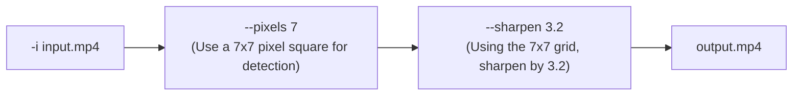
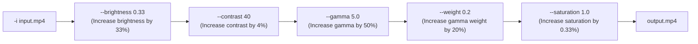
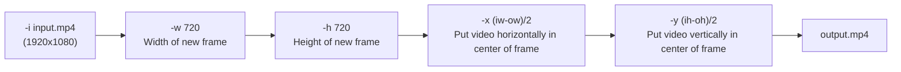

# FFMPEG Util scripts and Templates

This is a collection of scripts to automate simple video editing tasks.

The idea is that they can be chained together for more complex video effects and tasks.

These are all based on BASH and FFMPEG.

## Setup

Either update your $PATH to include this folder or create a link in `/usr/local/bin` to each script.

```
PATH=$PATH:$(pwd)
```

## Utility Scripts

Current list of scripts and their purposes.

| Script               | Description                                                      |
| -------------------- | ---------------------------------------------------------------- |
| `ff_append.sh`       | This will concatenate two videos together and re-encode them     |
| `ff_aspect_ratio.sh` | Changes the container metadata's Display Aspect Ratio (DAR)      |
| `ff_blur.sh`         | Simple blur function using an unsharp mask                       |
| `ff_colour.sh`       | Change brightness, contrast, gamma, saturation of video          |
| `ff_concat.sh`       | Concatenate multiple videos together                             |
| `ff_crop.sh`         | Crop video to specific size                                      |
| `ff_cut.sh`          | Cut video from start time to end time.                           |
| `ff_flip.sh`         | Horizontally and/or vertically flip the video                    |
| `ff_fps.sh`          | Alter the FPS with changing length of video                      |
| `ff_grouptime.sh`    | Proportionally trims and concats videos to target video duration |
| `ff_lut.sh`          | Apply a 3DL/Cube LUT file to a video                             |
| `ff_middle.sh`       | Remove equal number of seconds from start and end of video       |
| `ff_pad.sh`          | Add a background padding around the video                        |
| `ff_rotate.sh`       | Rotate a video in 90 degree increments                           |
| `ff_scale.sh`        | Change the width and height of the video                         |
| `ff_sharpen.sh`      | Simple sharpen function using an unsharp mask                    |
| `ff_text.sh`         | Add text (with background box) on top of the video               |
| `ff_thumbnail.sh`    | Create thumbnail(s) from the video                               |
| `ff_to_landscape.sh` | Rotate a portrait video to landscape                             |
| `ff_to_portrait.sh`  | Rotate a landscape video to portrait                             |
| `ff_unsharp.sh`      | Use an unsharp mask to blur/sharpen luma,gamma,alpha             |
| `ff_watermark.sh`    | Overlay a watermark image/video                                  |


## Script Details

### `ff_append.sh`

#### Description
This will append two files together while re-encoding them to be the same codec. Good if you need to change the codec of the video by transcoding them. Note the `ff_concat.sh` script is better if you do not need to transcode.


#### Flags
```bash
Flags:
 -f | --first <FIRST_INPUT_FILE>
        The name of the first input file.

 -s | --second <SECOND_INPUT_FILE>
        The name of the second input file.

 -o | --output <OUTPUT_FILE>
        Default is output_appended.mp4
        The name of the output file.

 -l | --loglevel <LOGLEVEL>
        The FFMPEG loglevel to use. Default is 'error' only.
        Options: quiet,panic,fatal,error,warning,info,verbose,debug,trace
```

#### Example

```bash
./ff_append.sh -f landscape2.mp4 -s landscape.mp4 -o out.mp4
```


### `ff_aspect_ratio.sh`

#### Description

This will alter the container metadata (DAR) of the video to the new aspect ratio.


#### Flags

```
-i | --input <INPUT_FILE>
        The name of an input file.

 -o | --output <OUTPUT_FILE>
        Default is output_aspect_ratio.mp4
        The name of the output file.

 -a | --aspect <ASPECTRATIO>
        Target aspect ratio should be expressed as X:Y
        Default is 1:1

 -l | --loglevel <LOGLEVEL>
        The FFMPEG loglevel to use. Default is 'error' only.
        Options: quiet,panic,fatal,error,warning,info,verbose,debug,trace
```


### `ff_blur.sh`

#### Description

Simple version of unsharp mask.



#### Flags
```
 -i | --input <INPUT_FILE>
        The name of an input file.

 -o | --output <OUTPUT_FILE>
        Default is output_sharpen.mp4
        The name of the output file.

 -p | --pixels <AMOUNT>
        Both the X and Y matrix horizontal size. It must be an odd integer between 3 and 23. The default value is 5.

 -s | --sharpen <AMOUNT>
        Set the sharpen strength. It must be a floating point number. -2.0 to 5.0. Default value is 1.0.
        Negative values will blur the input video, while positive values will sharpen it, a value of zero will disable the effect.

 -l | --loglevel <LOGLEVEL>
        The FFMPEG loglevel to use. Default is 'error' only.
        Options: quiet,panic,fatal,error,warning,info,verbose,debug,trace
```


### `ff_colour.sh`

#### Description

Change the Brightness, Contrast, Gamma, Gamma-Weight and Saturation of a video.



#### Flags

```
 -i | --input <INPUT_FILE>
        The name of an input file.

 -o | --output <OUTPUT_FILE>
        Default is output_colour.mp4
        The name of the output file.

 -b | --brightness <BRIGHTNESS>
        Change the brightness value from -1.0 to 1.0.

 -c | --contrast <CONTRAST>
        Change the contrast value from -1000.0 to 1000.0.

 -g | --gamma <GAMMA>
        Change the gamma value from 0.1 to 10.0.

 -s | --saturation <SATURATION>
        Change the saturation value from 0.0 to 3.0.

 -w | --weight <GAMMAWEIGHT>
        Change the gamma weight value from 0.0 to 1.0.

 -l | --loglevel <LOGLEVEL>
        The FFMPEG loglevel to use. Default is 'error' only.
        Options: quiet,panic,fatal,error,warning,info,verbose,debug,trace
```


### `ff_concat.sh`

#### Description

Concatenate multiple videos into one output video.


#### Flags
```
 -o | --output <OUTPUT_FILE>
        The name of the output file. Specify only one.

 -i | --input <INPUT_FILE>
        The name of an input file. Specify as many as you wish.

 -l | --loglevel <LOGLEVEL>
        The FFMPEG loglevel to use. Default is 'error' only.
        Options: quiet,panic,fatal,error,warning,info,verbose,debug,trace
```


### `ff_crop.sh`

#### Description

Crop video to specific size




#### Flags

```
 -i | --input <INPUT_FILE>
        The name of an input file.

 -o | --output <OUTPUT_FILE>
        Default is output_crop.mp4
        The name of the output file.

 -w | --width <WIDTH>
        Width of the output video. Default: 600px.

 -h | --height <HEIGHT>
        Height of the output video. Default: 600px.

 -x | --xpixels <PIXELS>
        Where to position the video in the frame on X-Axis from left. Default center: (iw-ow)/2

 -y | --ypixels <PIXELS>
        Where to position the video in the frame on Y-Axis from top. Default center: (ih-oh)/2

        The width, height, x and y parameters also have access to the following variables:
        - iw : The input video's width.
        - ih : The input video's height.
        - ow : The output video's width.
        - oh : The output video's height.
        These can be used to calculate areas of the screen. For example:
        The center of the screen on x-axis is 'x=(ow-iw)/2

 -l | --loglevel <LOGLEVEL>
        The FFMPEG loglevel to use. Default is 'error' only.
        Options: quiet,panic,fatal,error,warning,info,verbose,debug,trace
```


### `ff_cut.sh`

#### Description

Change the length of the video.


#### Flags

```
 -i | --input <INPUT_FILE>
        The name of an input file.

 -o | --output <OUTPUT_FILE>
        Default is output_cut.mp4
        The name of the output file.

 -s | --start <TIMESTAMP>
        When to start the cut. Format is HH:MM:SS. Default is the beginning of the video. 00:00:00.

 -e | --end <TIMESTAMP>
        When to finish the cut. Format is HH:MM:SS. Default is 10 seconds into the video. 00:00:10.

 -l | --loglevel <LOGLEVEL>
        The FFMPEG loglevel to use. Default is 'error' only.
        Options: quiet,panic,fatal,error,warning,info,verbose,debug,trace
```


### `ff_flip.sh`

#### Description

Flip video horizontally and/or vertically.


#### Flags

```
 -i | --input <INPUT_FILE>
        The name of an input file.

 -o | --output <OUTPUT_FILE>
        Default is output_flipped.mp4
        The name of the output file.

 -h | --horizontal
        Flip video horizontally.

 -v | --vertical
        Flip video vertically.

 -l | --loglevel <LOGLEVEL>
        The FFMPEG loglevel to use. Default is 'error' only.
        Options: quiet,panic,fatal,error,warning,info,verbose,debug,trace
```


### `ff_fps.sh`

#### Description

Change the FPS of a video without changing the length.


#### Flags
```
 -i | --input <INPUT_FILE>
        The name of an input file.

 -o | --output <OUTPUT_FILE>
        Default is output_fps.mp4
        The name of the output file.

 -f | --fps <FPS>
        The frames per second the video should be converted to. The default value is 30.
        The length of the video will not change, but frames will either be added or removed.

 -l | --loglevel <LOGLEVEL>
        The FFMPEG loglevel to use. Default is 'error' only.
        Options: quiet,panic,fatal,error,warning,info,verbose,debug,trace
```


### `ff_grouptime.sh`

#### Description

Trim input videos by a percentage on start and end to get output video to correct duration.


#### Flags
```
 -i | --input <INPUT_FILE>
        The name of an input file.

 -o | --output <OUTPUT_FILE>
        Default is output_grouptime.mp4
        The name of the output file.

 -d | --duration <DURATION>
        The final duration of the output file in seconds. Default is 60. 

 -l | --loglevel <LOGLEVEL>
        The FFMPEG loglevel to use. Default is 'error' only.
        Options: quiet,panic,fatal,error,warning,info,verbose,debug,trace
```


### `ff_lut.sh`

#### Description

Apply a 3DL/Cube Look-Up Table (LUT) file to a video.

#### Flags
```
 -i | --input <INPUT_FILE>
        The name of an input file.

 -o | --output <OUTPUT_FILE>
        Default is output_lut.mp4
        The name of the output file.

 -t | --lut <LUT_FILE>
        The Look-Up-Table (LUT) should be in a 3DL/Cube format.
        there is no default, so must be supplied.

 -l | --loglevel <LOGLEVEL>
        The FFMPEG loglevel to use. Default is 'error' only.
        Options: quiet,panic,fatal,error,warning,info,verbose,debug,trace
```


### `ff_middle.sh`

#### Description

Trim input video from start and end by a number of seconds.


#### Flags
```
 -i | --input <INPUT_FILE>
        The name of an input file.

 -o | --output <OUTPUT_FILE>
        Default is output_middle.mp4
        The name of the output file.

 -t | --trim <TRIM>
        Number of seconds to remove from the start and end of video. Default is 1 second. (1) 

 -l | --loglevel <LOGLEVEL>
        The FFMPEG loglevel to use. Default is 'error' only.
        Options: quiet,panic,fatal,error,warning,info,verbose,debug,trace
```

### `ff_pad.sh`

#### Description

Create padding around the edges of the video.


#### Flags
```
 -i | --input <INPUT_FILE>
        The name of an input file.

 -o | --output <OUTPUT_FILE>
        Default is output_pad.mp4
        The name of the output file.

 -w | --width <WIDTH>
        Width of the output video. Default: Same as input video.

 -h | --height <HEIGHT>
        Height of the output video. Default: 2x input video height.

 -x | --xpixels <PIXELS>
        Where to position the video in the frame on X-Axis from left.

 -y | --ypixels <PIXELS>
        Where to position the video in the frame on Y-Axis from top.

        The width, height, x and y parameters also have access to the following variables:
        - iw : The input video's width.
        - ih : The input video's height.
        - ow : The output video's width.
        - oh : The output video's height.
        These can be used to calculate areas of the screen. For example:
        The center of the screen on x-axis is 'x=(ow-iw)/2

 -c | --colour <COLOUR>
        Colour to use for the padding. See https://ffmpeg.org/ffmpeg-utils.html#color-syntax
        Can use a word 'Aqua, Beige, Cyan, etc...', the word 'random' or hex code : RRGGBB[AA] 

 -l | --loglevel <LOGLEVEL>
        The FFMPEG loglevel to use. Default is 'error' only.
        Options: quiet,panic,fatal,error,warning,info,verbose,debug,trace
```

#### Examples

Padding all around the video.

       ./ff_pad.sh -i input.mp4 -h 'ih*2' -w 'iw*2'

Video Pad white background.

       ./ff_pad.sh -i input.mp4 -h 'ih*2' -c white

Make black bars..

       /ff_pad.sh -i input.mp4 -w iw -h ih+100 -y '(oh-ih)/2' -x '(ow-iw)/2' -c #000000


### `ff_rotate.sh`

#### Description

Rotate a video.


#### Flags

```
Usage: ./ff_rotate.sh FILE [ROTATION] [OUTPUT_FILE]

[rotation]
0 = 180 Degrees
1 = 90 Degrees Clockwise
2 = 90 Degrees Counter Clockwise (default)

[output file]
output_rotate.mp4 (default)
```

### `ff_scale.sh`

#### Description

Change the scale (Width/Height) of a video.


#### Flags

```
 -i | --input <INPUT_FILE>
        The name of an input file.

 -o | --output <OUTPUT_FILE>
        Default is output_scale.mp4
        The name of the output file.

 -w | --width <PIXELS>
        The width of the video. The default value is 1920.

 -h | --height <PIXELS>
        The height of the video. The default value is 1920.

 -l | --loglevel <LOGLEVEL>
        The FFMPEG loglevel to use. Default is 'error' only.
        Options: quiet,panic,fatal,error,warning,info,verbose,debug,trace
```


### `ff_sharpen.sh`

#### Description

Simple version of unsharp mask.

#### Flags

```
 -i | --input <INPUT_FILE>
        The name of an input file.

 -o | --output <OUTPUT_FILE>
        Default is output_sharpen.mp4
        The name of the output file.

 -p | --pixels <AMOUNT>
        Both the X and Y matrix horizontal size. It must be an odd integer between 3 and 23. The default value is 5.

 -s | --sharpen <AMOUNT>
        Set the sharpen strength. It must be a floating point number. -2.0 to 5.0. Default value is 1.0.
        Negative values will blur the input video, while positive values will sharpen it, a value of zero will disable the effect.

 -l | --loglevel <LOGLEVEL>
        The FFMPEG loglevel to use. Default is 'error' only.
        Options: quiet,panic,fatal,error,warning,info,verbose,debug,trace
```


### `ff_text.sh`

#### Description

Add text (with background box) on top of the video.


#### Flags
```
 -i | --input <INPUT_FILE>
        The name of an input file.

 -o | --output <OUTPUT_FILE>
        Default is output_text.mp4
        The name of the output file.

 -t | --text <TEXT>
        Text to write over video. Default: EXAMPLE.

 -f | --font <FONT>
        Path to font file to use. Default: /System/Library/Fonts/HelveticaNeue.ttc

 -c | --color <FONTCOLOUR>
        The font colour to use. Can be Hex RRGGBB or name and include alpha with '@0.5' after. Default: white.

 -s | --size <FONTSIZE>
        The font size to use. Default: 24.

 -b | --box <BOX>
        Show the background box. Boolean. 1 or 0. Default: 1.

 -p | --boxcolour <PAINTCOLOUR>
        The background paint colour to use. Can be Hex RRGGBB or name and include alpha with '@0.5' after. Default: black.

 -r | --boxborder <BOXBORDER>
        Width of the border on the background box around the text. Default: 5.

 -x | --xpixels <PIXELS>
        Where to position the text in the frame on X-Axis from left. Default center: (w-tw)/2

 -y | --ypixels <PIXELS>
        Where to position the text in the frame on Y-Axis from top. Default center: (h-th)/2

        The x and y parameters also have access to the following variables:
        - w : The input video's width.
        - h : The input video's height.
        - tw : The rendered text width.
        - th : The rendered text height.
        - lh : The line height.
        These can be used to calculate areas of the screen. For example:
        The center of the screen on x-axis is 'x=(ow-iw)/2

 -l | --loglevel <LOGLEVEL>
        The FFMPEG loglevel to use. Default is 'error' only.
        Options: quiet,panic,fatal,error,warning,info,verbose,debug,trace
```


### `ff_thumbnail.sh`

#### Description

Create thumbnails representative of the video.

#### Flags

```
 -i | --input <INPUT_FILE>
        The name of an input file.

 -o | --output <OUTPUT_FILE>
        Default is output_thumbnail.png
        The name of the output image file.

 -c | --count <COUNT>
        The number of thumbnails to create. The default value is 1.
        Uses a batch sample size of 300 frames. If there are less frames than the count, you will get less thumbnails.
 -s | --sample <SAMPLE>
        The batch sample sizee. The default value is 300.
        Size of the number of frames to analyse to create a thumbnail from. Each thumbnail will use the next batch.
 -l | --loglevel <LOGLEVEL>
        The FFMPEG loglevel to use. Default is 'error' only.
        Options: quiet,panic,fatal,error,warning,info,verbose,debug,trace
```

### `ff_to_landscape.sh`

#### Description

Convert a portrait video to landscape.


#### Flags

```

 -i | --input <INPUT_FILE>
        The name of an input file.

 -o | --output <OUTPUT_FILE>
        Default is output_landscape.mp4
        The name of the output file.

 -r | --rotation <ROTATION>
        0 = 90CounterCLockwise and Vertical Flip
        1 = 90Clockwise
        2 = 90CounterClockwise (default)
        3 = 90Clockwise and Vertical Flip

 -l | --loglevel <LOGLEVEL>
        The FFMPEG loglevel to use. Default is 'error' only.
        Options: quiet,panic,fatal,error,warning,info,verbose,debug,trace
```


### `ff_to_portrait.sh`

#### Description

Convert a landscape video to portrait.


#### Flags
```
 -i | --input <INPUT_FILE>
        The name of an input file.

 -o | --output <OUTPUT_FILE>
        Default is output_portrait.mp4
        The name of the output file.

 -r | --rotation <ROTATION>
        0 = 90CounterCLockwise and Vertical Flip
        1 = 90Clockwise (default)
        2 = 90CounterClockwise
        3 = 90Clockwise and Vertical Flip

 -l | --loglevel <LOGLEVEL>
        The FFMPEG loglevel to use. Default is 'error' only.
        Options: quiet,panic,fatal,error,warning,info,verbose,debug,trace
```


### `ff_unsharp.sh`

#### Description

Uses an unsharp mask to alter the luma,chroma and alpha of a video.

#### Flags

```
 -i | --input <INPUT_FILE>
        The name of an input file.

 -o | --output <OUTPUT_FILE>
        Default is output_unsharp.mp4
        The name of the output file.

 -lx | --luma_x <SIZE>
        Set the luma matrix horizontal size. It must be an odd integer between 3 and 23. The default value is 5.

 -ly | --luma_y <SIZE>
        Set the luma matrix vertical size. It must be an odd integer between 3 and 23. The default value is 5.

 -la | --luma_amount <AMOUNT>
        Set the luma effect strength. It must be a floating point number. -2.0 to 5.0. Default value is 1.0.
        Negative values will blur the input video, while positive values will sharpen it, a value of zero will disable the effect.

 -cx | --chroma_x <SIZE>
        Set the chroma matrix horizontal size. It must be an odd integer between 3 and 23. The default value is 5.

 -cy | --chroma_y <SIZE>
        Set the chroma matrix vertical size. It must be an odd integer between 3 and 23. The default value is 5.

 -ca | --chroma_amount <AMOUNT>
        Set the chroma effect strength. It must be a floating point number. Default value is 0.0.
        Negative values will blur the input video, while positive values will sharpen it, a value of zero will disable the effect.

 -ax | --alpha_x <SIZE>
        Set the alpha matrix horizontal size. It must be an odd integer between 3 and 23. The default value is 5.

 -ay | --alpha_y <SIZE>
        Set the alpha matrix vertical size. It must be an odd integer between 3 and 23. The default value is 5.

 -aa | --alpha_amount <AMOUNT>
        Set the alpha effect strength. It must be a floating point number. Default value is 0.0.
        Negative values will blur the input video, while positive values will sharpen it, a value of zero will disable the effect.

        All parameters are optional and default to the equivalent of the string '5:5:1.0:5:5:0.0'.

 -l | --loglevel <LOGLEVEL>
        The FFMPEG loglevel to use. Default is 'error' only.
        Options: quiet,panic,fatal,error,warning,info,verbose,debug,trace
```


### `ff_watermark.sh`

#### Description

Overlay a watermark on the video.


#### Flags
```
 -i | --input <INPUT_FILE>
        The name of an input file.

 -o | --output <OUTPUT_FILE>
        Default is output_watermarked.mp4
        The name of the output file.

 -w | --watermark <WATERMARK_FILE>
        Note that you CAN use videos as the watermark.
        Image to use for the watermark.

 -x | --xpixels <PIXELS>
        Position of the watermark. Number of pixels on X-Axis. Default 10.
        There are variables that also can be used:
        - (W) is the width of the video
        - (H) is the height of the video
        - (w) is the width of the watermark
        - (h) is the height of the watermark
        The following example will center the watermark:
        ff_watermark -i input.mp4 -w watermark.png -x "(W-w)/2" -y "(H-h)/2" 

 -y | --ypixels <PIXELS>
        Position of the watermark. Number of pixels on Y-Axis. Default 10.

 -s | --scale <SCALE>
        Size of the watermark in relation to the height of the video. Default is 0.2 (1/5th height)

 -a | --alpha <ALPHA>
        Transparency (alpha channel) of the watermark. From 0 to 1. Default is 1.

 -l | --loglevel <LOGLEVEL>
        The FFMPEG loglevel to use. Default is 'error' only.
        Options: quiet,panic,fatal,error,warning,info,verbose,debug,trace
```

#### Examples

Center large watermark:

       ff_watermark -i input.mp4 -w watermark.png -s 0.4 -x "(W-w)/2" -y "(H-h)/2"

Small bottom right watermark:

       ff_watermark -i input.mp4 -w watermark.png -s 0.1 -x "(W-w)" -y "(H-h)"

Full-size watermark:

       ff_watermark -i input.mp4 -w watermark.png -s 1

Full-size semi-transparent watermark:

       ff_watermark -i input.mp4 -w watermark.png -s 1 -a 0.5

Small, transparent bottom-right positioned Video as a watermark:

       ff_watermark -i input.mp4 -w watermark_video.mp4 -s 0.3 -x "(W-w)" -y "(H-h)" -a 0.5